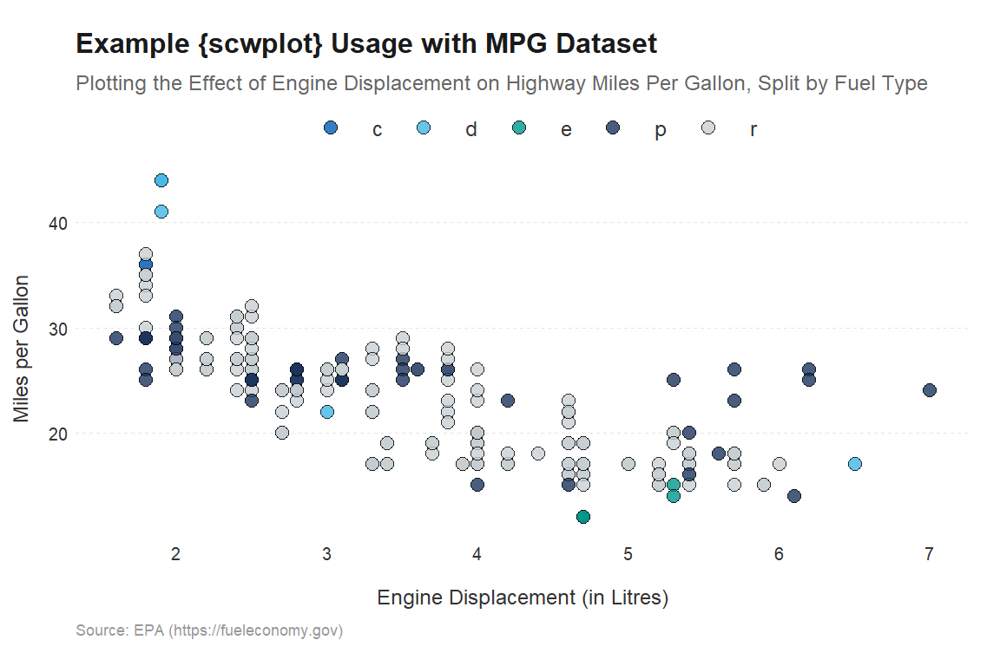

<!-- README.md is generated from README.Rmd. Please edit that file -->

# scwplot <a href="https://nhs-south-central-and-west.github.io/scwplot/"></a>

<!-- badges: start -->

[](https://github.com/NHS-South-Central-and-West/scwplot/actions/workflows/check-standard.yaml)
[](https://codecov.io/gh/NHS-South-Central-and-West/scwplot)
[](https://lifecycle.r-lib.org/articles/stages.html#experimental)
<!-- badges: end -->

The scwplot package provides functions for applying consistent
SCW-branded aesthetics to ggplot visualisations in R, as well as
additional functionality that produces clean plots and makes plotting in
R easier.

## Installation

scwplot is not available on CRAN. In order to install the package, you
must do so directly from this GitHub repository with {devtools}, using
the code below:

``` r
# install.packages('pak')
pak::pak("NHS-South-Central-and-West/scwplot")
```

If you haven’t already installed devtools, you will also have to run the
first line of code in the code chunk.

## Usage

The primary purpose of scwplot is to extend the functionality of ggplot
to create consistent SCW-style figures, so usage builds on top of basic
[ggplot2](https://ggplot2.tidyverse.org/) functionality.

A simple example of the scwplot usage:

``` r
library(ggplot2)
library(scwplot)

ggplot(mpg, aes(displ, hwy, fill = fl)) + geom_point(shape = 21, size = 5, stroke = 1,
    alpha = 0.8) + labs(title = "Example {scwplot} Usage with MPG Dataset", subtitle = glue::glue("Plotting the Effect of Engine Displacement on ",
    "Highway Miles Per Gallon, Split by Fuel Type"), caption = "Source: EPA (https://fueleconomy.gov)",
    x = "Engine Displacement (in Litres)", y = "Miles per Gallon") + scale_fill_qualitative(palette = "scw") +
    theme_scw()
```



The package includes the following functionality:

- Themes - functions for controlling the display of plot theme elements.
- Colour - functions for incorporating the use of colour to display
  data.
- Images - functions for adding images (i.e., brand images and logos) to
  plots.
- Format - functions for applying final formatting to a plot and saving
  it to file.

## Acknowledgements

This package takes a lot of inspiration from the NHS-R community’s
[NHSRtheme](https://github.com/nhs-r-community/NHSRtheme) package and
BBC’s [bbplot](https://github.com/bbc/bbplot) package. The code, the
structure of the repository, and the approach taken to achieve the
package’s goals has been influenced by
[ggplot2](https://ggplot2.tidyverse.org/) and
[ggsci](https://nanx.me/ggsci/).
